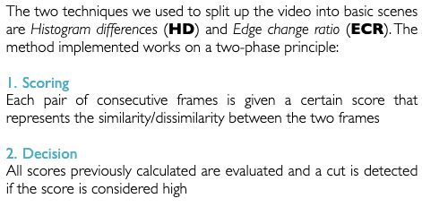
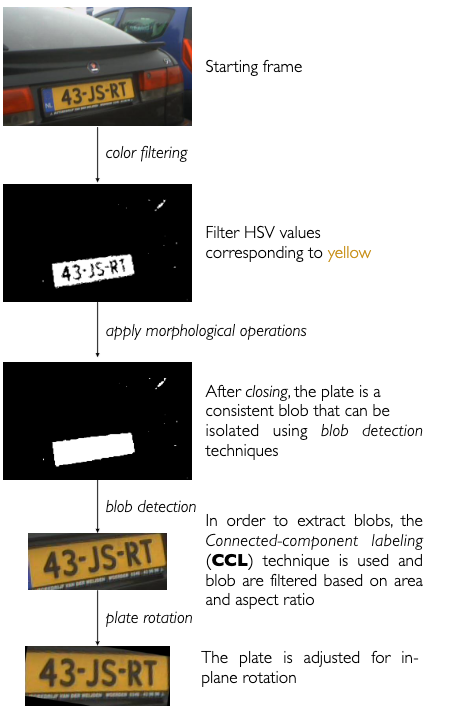

# License-Plate-Detection

Given an input video, the system is able to identify license-plates and recognize the characters. The output is a `csv` where each license-plate is linked to its frame of appearance.

The following is a break down of the pipeline and the different techniques that we used.

## Shot transition

## Plate Localization

## Character Recognition

## Further improvements

- Generalize to any Plate color
- Adapt to different Light Conditions
- Extend Template Matching in OCR to all characters

